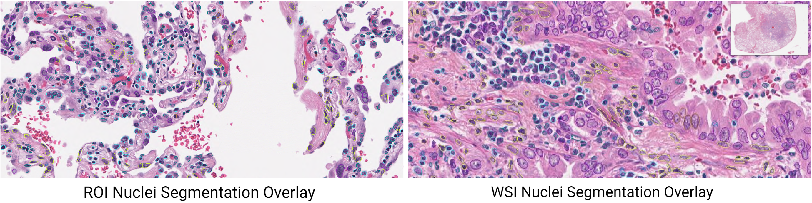

# NucleiSegHE
[](https://doi.org/10.5281/zenodo.7480809)

H&E ROI-Level and WSI-Level Nuclei Segmentation with HoVer-Net - [pretrained model and demo ROIs/WSIs](https://www.synapse.org/#!Synapse:syn50545401/files).


## Environment Configurations
### a. Prepare docker image
* Build from Dockerfile
```
$ docker build --platform linux/x86_64 -t nucleiseghe:pchen6 .
```
* Or pull from Docker Hub
```
$ docker pull pingjunchen/nucleiseghe:pchen6
$ docker tag pingjunchen/nucleiseghe:pchen6 nucleiseghe:pchen6
```
### b. Setup docker container
* Start docker container (specify CODE_ROOT & DATA_ROOT)
```
$ docker run -it --rm --user $(id -u):$(id -g) \
  -v ${CODE_ROOT}:/App/NucleiSegHE \
  -v ${DATA_ROOT}:/Data \
  --shm-size=32G --gpus '"device=0"' --cpuset-cpus=0-15 \
  --name nucleiseghe_pchen6 nucleiseghe:pchen6
```
* For example:
```
$ docker run -it --rm  --user $(id -u):$(id -g) \
  -v /rsrch1/ip/pchen6/Codes/CHEN/NucleiSegHE:/App/NucleiSegHE \
  -v /rsrch1/ip/pchen6/NucleiSegData:/Data \
  --shm-size=32G --gpus '"device=0"' --cpuset-cpus=0-15 \
  --name nucleiseghe_pchen6 nucleiseghe:pchen6
```

## ROI-Level Nuclei Seg (support png)
Inside the docker container, enter */App/NucleiSegHE*
```
# Nuclei Segmentation
$ python 01_roi_seg_nuclei.py --dataset LungNYU
# Nuclei Overlay
$ python 02_roi_nuclei_overlay.py --dataset LungNYU
```

## WSI-Level Nuclei Seg (support svs/tiff)
Inside the docker container, enter */App/NucleiSegHE*
```
# Split WSI into smaller blocks (5000 x 5000)
$ python 00_wsi_split_blocks.py --dataset CLL
# Block-wise WSI nuclei segmentation and merging
$ python 01_wsi_seg_nuclei.py --dataset CLL
# Nuclei overlay to the entire WSI
$ python 02_wsi_nuclei_overlay.py --dataset CLL
```

## Acknowledgements
This repo is adapted from following codes
- [vqdang/hover_net](https://github.com/vqdang/hover_net)
- [simongraham/hovernet_inference](https://github.com/simongraham/hovernet_inference)

Please consider citing the following two papers if this repo was used for nuclei segmentation in your research
- [Hover-Net: Simultaneous segmentation and classification of nuclei in multi-tissue histology images](https://www.sciencedirect.com/science/article/pii/S1361841519301045)
- [PanNuke: an open pan-cancer histology dataset for nuclei instance segmentation and classification](https://link.springer.com/chapter/10.1007/978-3-030-23937-4_2)
